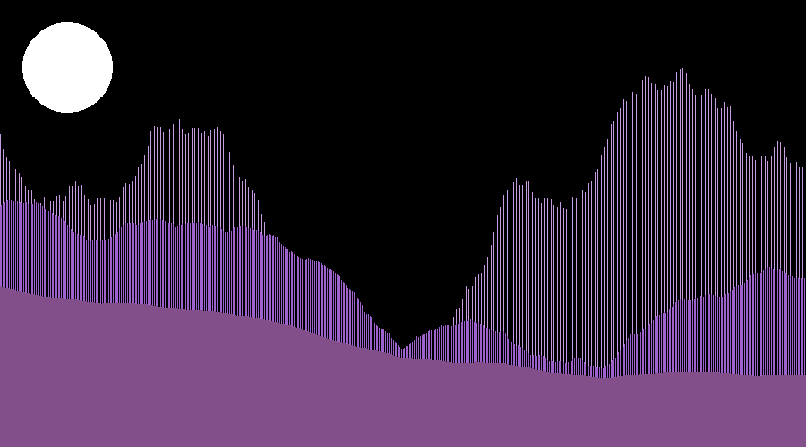

# 2D Landscape

When I was in grade 4, I used to draw landscapes and would feel so good and engaged. To my surprise now, those landscapes were way too good for my current drawing skills. But now, I know a little programming so why not tell Python to make beautiful landscapes for us. I have used Mid-Point Algorithm to divide the points and create fractals.

Version 1

Version 2

